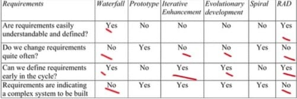
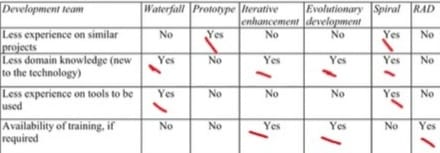
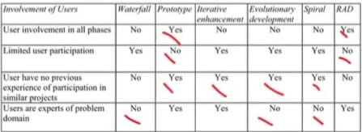
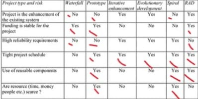

### 3.1 **Estratégia Priorizada**

**Abordagem:** Ágil

**Ciclo de vida:** Iterativo e Incremental.

**Processo:** RAD(Rapid Application Development) e SCRUM.

### 3.2 **Quadro Comparativo**

O quadro a seguir apresenta características dos processos RAD e SCRUM que serão utilizados e também do OpenUp para comparação, buscando justificar a escolha do processo adequado ao Dida’s Bistrô.

| Características            | RAD                                        | SCRUM                                      | OpenUP                                     |
|----------------------------|--------------------------------------------|--------------------------------------------|--------------------------------------------|
| **Abordagem Geral**         | Iterativo e incremental com ênfase em entregas rápidas por meio de prototipagem. | Iterativo e incremental, com foco em entregas frequentes e feedback contínuo. | Iterativo, incremental e baseado em arquitetura sólida. |
| **Foco em Arquitetura**     | Arquitetura evolui durante o processo, com foco inicial na prototipagem. | Não prescreve foco específico em arquitetura, a arquitetura evolui conforme as necessidades do projeto. | Forte ênfase no desenvolvimento orientado a uma arquitetura sólida e flexível desde o início do projeto. |
| **Estrutura de Processos**  | Dividido em fases (requisitos, prototipação, construção e testes). Cada fase é chamada de timebox que duram de 1-4 semanas. | Focado em sprints curtos e flexíveis (2-4 semanas) com entregas incrementais e adaptação contínua durante o projeto. | Estrutura clara de fases: Iniciação, Elaboração, Construção e Transição. |
| **Flexibilidade de Requisitos** | Alta flexibilidade para alterações rápidas nos requisitos, facilitada pela prototipagem e os feedbacks. | Alta flexibilidade para mudanças contínuas de requisitos a cada sprint. Adaptável a feedback frequente do cliente. | Flexibilidade para adaptações iterativas, com a arquitetura principal definida cedo. |
| **Colaboração com Cliente** | Envolvimento frequente do cliente para validação de protótipos e ajustes rápidos. | Envolvimento contínuo do cliente com feedback ao final de cada sprint. | Requer envolvimento contínuo do cliente, especialmente nas fases de validação. |
| **Complexidade do Processo** | Mais leve, com foco na prototipagem e desenvolvimento rápido; menos formalidade. | Estrutura leve, focada na entrega funcional e adaptação contínua; menos documentação. | Mais formal, com documentação e fases estruturadas, requerendo disciplina e papéis claros. |
| **Qualidade Técnica**       | Garantida pela rápida construção e teste de protótipos, ajustes são feitos conforme feedback. | Alta ênfase na qualidade técnica, com práticas como TDD (Test-Driven Development), pair programming e integração contínua para garantir um código limpo e funcional. | Qualidade assegurada pela definição de arquitetura e validação incremental. |
| **Práticas de Desenvolvimento** | Foco na prototipagem e validação rápida, com menos práticas técnicas estruturadas. | Inclui práticas técnicas robustas como TDD, refatoração contínua, integração contínua e pair programming, promovendo alta qualidade no código. | Estrutura mais formal com foco em arquitetura e controle de progresso. Menos práticas técnicas específicas dentro do processo de desenvolvimento. |
| **Adaptação ao Projeto do Dida’s Bistrô** | Ideal em projetos que precisam de protótipos rápidos e ajustes com o cliente. | Ideal para projetos onde a interação constante com o cliente e a evolução contínua do produto são fundamentais. Adaptável a mudanças frequentes e rápidos ciclos de feedback. | Ideal para projetos que exigem uma arquitetura bem definida, mas flexibilidade incremental. |
| **Documentação**           | Mínima documentação. O foco em comunicação direta com o cliente para ajustes rápidos. | Minimiza a documentação formal, priorizando comunicação rápida e feedback. | Requer documentação formal para cada fase, com ênfase em requisitos e arquitetura. |
| **Controle de Qualidade**  | Baseado em revisões de protótipos e ajustes ao longo do desenvolvimento. | Controle de qualidade embutido nas práticas do XP, como TDD e integração contínua. | Controle de qualidade através de validações incrementais e revisões de arquitetura. |
| **Escalabilidade**         | Escalável para projetos de pequena a média escala, em projetos maiores, pode enfrentar desafios devido à sua natureza menos formal. | Escalável, mas mais indicado para equipes menores e médias devido à sua abordagem colaborativa e interativa constante. | Escalável para projetos maiores e mais complexos, com equipes médias a grandes. |
| **Suporte a Equipes de Desenvolvimento** | Suporta equipes menores, com foco na colaboração e menos formalidade nos papeis. | Suporta equipes menores e mais colaborativas, com papeis mais flexíveis, permitindo maior adaptação ao ritmo do projeto. | Suporta equipes maiores e com mais papeis definidos, pois requer mais controle sobre o progresso e as fases do projeto. |

### 3.3 **Justificativa**

Baseado nos critérios proposto por Gupta para a escolha de processos, respondemos uma série de questões sobre os tópicos abordados pelos critérios para definir o modelo de desenvolvimento que será utilizado ao longo do projeto. Optamos pelo RAD como framework mostrou e adaptamos algumas características do SCRUM para melhor adequação ao Dida’s Bistrô.

Watterfall: 10 
Prototype: 10 
Iterative Enhancement: 6 
Evolutionary development: 7 
Spiral: 9 
**RAD: 11** 

**Rapidez:**
O RAD visa acelerar o processo de desenvolvimento. Isso é alcançado através de ciclos de desenvolvimento curtos, permitindo que os produtos sejam entregues mais rapidamente.

**Flexibilidade:**
Incentiva a adaptação rápida às mudanças. O RAD permite ajustes no decorrer do projeto sem grandes impactos nos prazos graças à constante prototipagem e os feedbacks.

**Prototipagem:**
O uso de protótipos é central no RAD, permitindo que desenvolvedores testem e ajustem funcionalidades, de acordo com os requisitos do cliente, o que será de extrema importância para o Dida’s Bistrô.

**Organização:**
A organização é baseada na realização de fases com timebox de 15 dias, as reuniçoes são as de planejamento e retrospectiva e revisão. A gestão das histórias de usuários é realizada através do ZenHub, a comunicação interna é com a utilização de aplicativo de mensagem instantânea e a comunicação com o cliente é utilizando o Microsoft Teams como reuniões gravadas.

**Cliente Ativo:**
Nosso cliente tem disponibilidade para estar presente em quase todas as nossas reuniões, por isso escolhemos a metodologia RAD, permitindo constantes feedbacks durante o processo de prototipação.

**Histórico de Revisão**

| **Data**   | **Versão** | **Descrição**                                                                         | **Autor**                                                                 |
| ---------- | ---------- | ------------------------------------------------------------------------------------- | ------------------------------------------------------------------------- |
| 08/11/2024 | 0\.0 | Criação do documento | Benjamim Lacerda |
| 11/11/2024 | 0\.1 | Atualização do Documento | Pedro Henrique |
| 11/11/2024 | 1\.0 | Primeira versão do documento | Benjamim Lacerda Santos, Iderlan Junio Cardoso da Silva, Mateus Henrique Queiroz Magalhães Sousa, Pedro Gois Marques Monteiro, Pedro Henrique |