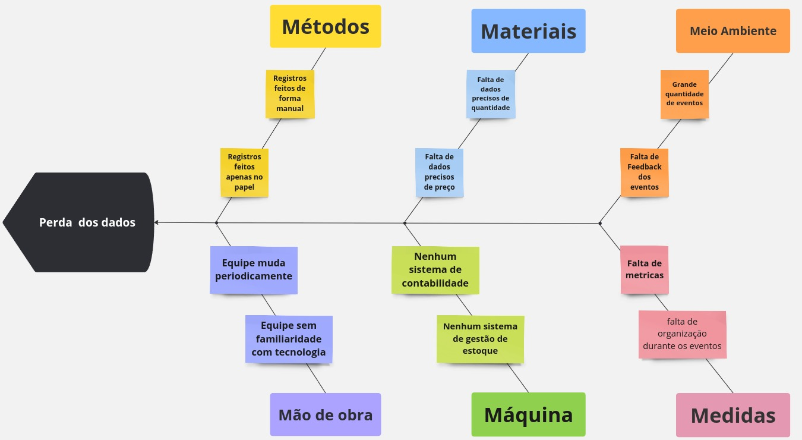

# **Visão do Produto e Projeto**
 
### 1.1 **Introdução ao Negócio e Contexto**

O Dida's Bistrô é um restaurante que realiza eventos privados, como festas e shows, com o objetivo de proporcionar experiências gastronômicas para seus clientes. Com um cardápio variado, adapta suas opções conforme a ocasião. Além disso, o Dida's Bistrô também atua como vendedor ambulante em shows e eventos em Brasília. 
 
Fundado em 2012, o negócio teve início com a venda de churros ambulante. Com o tempo, expandiu seu cardápio para incluir opções como hambúrguer, cachorro-quente, churrasquinho e macarrão. Hoje, o cardápio é flexível, permitindo que os pratos sejam ajustados conforme a demanda do evento. 

A partir de 2016, o Dida's Bistrô passou a organizar eventos privados, focando em festas juninas. Em 2022, recebeu o prêmio Sesc Comerciário Destaque, em reconhecimento pelas festas juninas realizadas nos Sesc de Brasília.

### 1.2 **Identificação da Oportunidade ou Problema**
O principal problema do Didas Bistrô é a perda ou má interpretação dos dados, o que é causado pelo uso exclusivo de papel para registro e controle. Isso dificulta o planejamento do negócio, já que, muitas vezes, a equipe não tem acesso a informações cruciais sobre eventos passados, como lucro, número de funcionários necessários e quantidade de ingredientes utilizados. Como resultado, a contabilidade fica comprometida, dificultando a análise de gastos, faturamento e lucro de cada evento. Além disso, a falta de registros adequados prejudica o planejamento futuro, pois não é possível avaliar se vale a pena repetir determinados eventos, já que os dados históricos estão frequentemente perdidos ou inacessíveis.

A falta de um sistema de gerenciamento de estoque também é um problema significativo. Muitas vezes, a equipe do Didas Bistrô não tem controle preciso sobre o gasto com ingredientes estocados, o que dificulta o planejamento para os eventos. Além disso, a falta de um acompanhamento adequado impede que saibam exatamente a quantidade de cada produto disponível, tornando o processo de compra e organização ineficiente e aumentando o risco de desperdício ou falta de insumos durante os eventos.

Segue abaixo um diagrama de Ishikawa sobre os problemas do cliente.

### 1.3 **Desafios do Projeto**

O principal desafio técnico é que o Didas Bistrô atualmente não utiliza nenhum software para gerenciar seus processos. Não há nenhum sistema existente que atenda aos requisitos específicos do negócio. Por isso, será necessário desenvolver uma solução do zero, capaz de atender a todas as necessidades operacionais. Além disso, é essencial que o software tenha uma interface intuitiva e de fácil usabilidade, para que qualquer pessoa, independentemente de sua experiência, consiga utilizá-lo, já que, para cada evento, são contratados profissionais diferentes.

### 1.4 **Segmentação de Clientes**

O produto será destinado a dona e aos funcionários da empresa, na qual podemos dividir em dois segmentos: 
 
Idosos com mais de 60 anos:  Usuários com poucas experiências tecnológicas e que utilizam celular. Possuem a necessidade de um software com poucas interações para realizar o seu objetivo.  

Jovens adultos entre 20 e 30 anos: Usuários com experiências tecnológicas em computadores e celulares. Capazes de utilizar o software sem dificuldades. 

**Histórico de Revisão**

| **Data**   | **Versão** | **Descrição**                                                                         | **Autor**                                                                 |
| ---------- | ---------- | ------------------------------------------------------------------------------------- | ------------------------------------------------------------------------- |
| 08/11/2024 | 0\.0 | Criação do documento | Benjamim Lacerda |
| 11/11/2024 | 0\.1 | Atualização do Documento | Pedro Henrique |
| 11/11/2024 | 1\.0 | Primeira versão do documento | Benjamim Lacerda Santos, Iderlan Junio Cardoso da Silva, Mateus Henrique Queiroz Magalhães Sousa, Pedro Gois Marques Monteiro, Pedro Henrique |